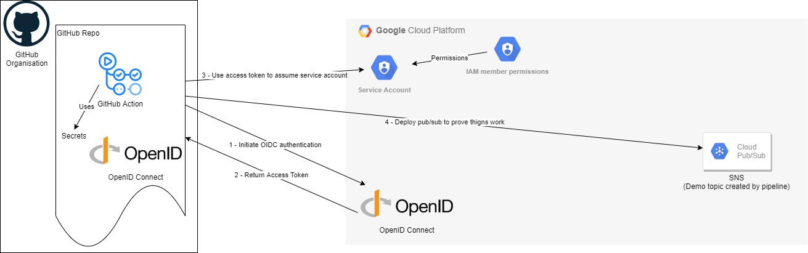

# gcp-github-oidc
Repo using OIDC to authenticate to GCP from GitHub Actions

This repo will create Open ID Connect in GCP and link it to GitHub, along with a role with permissions for GitHub to assume to provision resources.
This repo also includes a GitHub action which implements logging in with Open ID Connect

Instructions: -
  - Authenticate to GCP project you want to deploy to using your typical method (e.g. gcloud auth login)
  - Run the folliwing commands
    - terraform init
    - terraform apply
      - enter the project, github org and github repo you're deploying from
  - Add the following GitHub Secrets to your repository (within GitHub repo go to settings, secrets and create new secrets)
    - SERVICE_ACCOUNT - set to the name of the service account you've deployed (this will be github-action-account if using the default)
    - PROJECT_NUMBER - set as the GCP project number you've deployed the Terraform code to
    - PROJECT_ID - set as the GCP project number you've deployed the Terraform code to
  - Run the GitHub action that can now authenticate using OIDC
    - Navigate to GitHub actions and select 'Login to GCP using OIDC'
    - Select 'Run Workflow', set to branch you're working from and select 'Run workflow'
    - Navigate to GitHub action 'GCP using OIDC' and review the logs created by the runner

Please see my [blog article]() for more information.